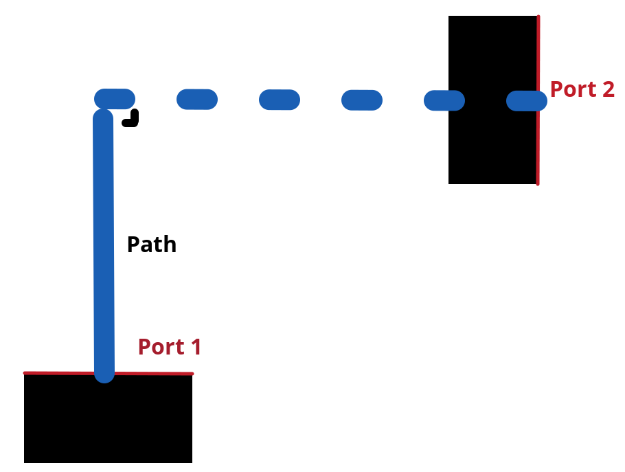
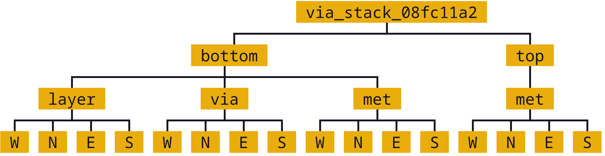

# Glayout
Glayout is a Python package consisting of a GDSFactory-based layout automation tool which generates DRC clean circuit layouts for any technology, and a library of common PCells such as MOSFETs and MIM Capacitors.

### Table of Contents
- [Example Jupyter Notebook](../../../docs/source/notebooks/glayout/glayout_opamp.ipynb)
- [Getting Started](#getting-started)
- [About Glayout](#about-glayout)
- [MappedPDK](#mappedpdk)
  - [Generic Layers](#generic-layers)
  - [Generic Rules](#generic-rules)
  - [Creating a MappedPDK](#creating-a-mappedpdk)
- [Layout Generators](#layout-generators)
  - [Generator Structure](#generator-structure)
  - [Routing](#routing)
  - [Primitive Cells](#primitive-cells)
    - [Via Array](#via-array)
    - [Tapring](#tapring)
    - [FET](#fet)
- [Advanced Topics](#advanced-topics)
  - [Cells and PDK.activate()](#cells-and-pdkactivate)
  - [Important GDSFactory Notes and Glayout Utilities](#important-gdsfactory-notes-and-glayout-utilities)
  - [Port Naming Best Practices Guide](#port-naming-best-practices-guide)
    - [PortTree](#porttree)
  - [Snap to 2x grid](#snap-to-2x-grid)
  - [Mimcaps Implementation](#mimcaps-implementation)
  - [DRC](#drc)
  - [LVS, and Labeling Issues](#lvs-and-labeling-issues)
  - [Addressing Complicated Requirments with Default Decorators](#addressing-complicated-requirments-with-default-decorators)
- [API overview](#api-overview)

### Getting Started
#### Installing Dependencies
- Install Python version 3.10 or later.
- Optionally, install KLayout for visualization and DRC.
  - Optionally, also install the "klive" plugin for KLayout that allows for opening a tab in KLayout directly from Python for visualization with the following steps:
    - Open KLayout.
    - Go to Tools -> Manage Packages.
    - Under "Install New Packages" search for "klive."
    - Install klive and when prompted, select "run macros."
- Run `python3 -m pip install -r requirements.txt` in the `gdsfactory-gen`` directory.

#### Using Glayout
Glayout is structured as a Python package in the `gdsfactory-gen/glayout` directory. The following submodules are exported by the package:
- `glayout.pdk`: Exports the [`MappedPDK`](#mappedpdk) class and the `MappedPDK` objects for Sky130 and GF180 PDKs.
- `glayout.primitives`: Exports primitive [cell generators](#layout-generators) such as FET, Guardring, and MiM Capacitor.
- `glayout.routing`: Exports [routing utilities](#routing).
- `glayout.components`: Exports intermediate PCell generators such as Differential Pair, and an example two-stage Op-Amp generator.

The following is an example usage code from the [`example.py`](./example.py) file.
```py
# Import the NMOS generator
from glayout.primitives.fet import nmos
# Import the Sky130 MappedPDK
from glayout.pdk.sky130_mapped import sky130_mapped_pdk

# Generate the component
component = nmos(sky130_mapped_pdk)

# Save the component in a .gds file
component.write_gds('example.gds')
```

### About Glayout
Glayout, being a generic layout automation tool, does not require an installed PDK, just a generic PDK description. Glayout is composed of 2 main parts: the generic PDK framework (`MappedPDK`) and the circuit generators.

The generic PDK framework allows for describing any PDK in a standardized format. The `pdk` sub-package within Glayout contains all code for the generic PDK class, `MappedPDK` in addition to instances of `MappedPDK` for the [Sky130](https://skywater-pdk.readthedocs.io/en/main/) and [GF180](https://gf180mcu-pdk.readthedocs.io/en/latest/) PDKs. Because `MappedPDK` is a python class, describing a technology with a `MappedPDK` allows for passing the PDK as a Python object.

The PDK generic circuit generator programs (also known as cells) are Python functions which take as arguments a `MappedPDK` object and a set of optional layout parameters to produce a DRC clean layout of a particular component. For example, an NMOS circuit generator would require the user to specify a `MappedPDK` and, optionally, the transistor length, width, number of fingers, etc.

### MappedPDK
There are only two absolute requirements for drawing a layout: a set of drawing layers, and a set of design rules governing the geometric dimensions between layers. All CMOS technologies must satisfy these two requirements. A `MappedPDK` object contains this information in a standardized format with "generic layers" and "generic rules."

#### Generic Layers
Almost all CMOS technologies have some version of basically the same layers, some of which are: **active/diffusion**, **metal contact**, **metal 1**,**via1**, etc. The layer description format of `tuple(integer, integer)` is standard. The idea of a generic layer (also called "glayers") is to map the standard layer names to the corresponding `tuple(integer, integer)` of the particular technology.

#####  Example Generic Layer Mappings
| Generic Layer Name | sky130 | gf180 |
| :-: | :-: | :-: |
|**mcon**| (66,44) | (33,0) |
|**met1**| (67,20) | (34,0) |
|**via1**| (67,44) | (35,0) |
|**met2**| (68,20) | (36,0) |

For example, a generic layer present in most technologies is **metal 2** (`met2`). In Sky130, the tuple `(68, 20)` represents **metal 2**, whereas in GF180 `(34,0)` is used. The designer is only concerned with the layer each tuple represents, which they can be accesses from the `MappedPDK` object in Python using the generic name.

`MappedPDK` provides the designer with all the generic layers necessary, some of which are: **diffusion**, **dnwell**, **nwell**, **pwell**, **p+s/d**, **n+s/d**, and **mcon**. The generic layers can be accessed using the following syntax:
```py
pdk.get_glayer("metal 2") # Here `pdk` is an instance of the `MappedPDK` class.
```

The `get_glayer()` instance method of the `MappedPDK` takes the generic layer name and returns the tuple specific to the technology. A `MappedPDK` object supports mappings for all design layers necessary. The BEOL generic layers support a metal stack **met1-met5**. Because metal stacks and some layers are technology dependent, the `MappedPDK` also the `has_required_glayers()` method for verifying the presence of layers. For example, if a technology BEOL contains **met1-met2**, but a cell requires **met1-met3**, it is possible for the cell generator to verify at runtime that the technology contains met3, as follows:

```py
pdk.has_required_glayers(["met1", "met2", "met3"])
```

#### Generic Rules
Almost all CMOS technologies have some version of basically the same three rules: `min_separation`, `min_enclosure`, and `min_width` (or `width` for via layers). Hundreds of rules can be created by prescribing one of these three rules pairs of layers. For example, there may be a rule which requires a `min_enclosure` between **via1** and **metal 2**. There can also be “self rules” or rules describing a requirement between a layer and itself; most `min_width` rules are self rules.

The description of CMOS rules provided in the above paragraph fits very well within a mathematical graph. Layers can be thought of as vertices in the graph and rules that describe relationships between layers can be thought of as edges in the graph. This graph can be described mathematically as an undirected graph.

[**TODO: INSERT FIGURE OF AN EXAMPLE RULE GRAPH**]

To greatly simplify the rule graph, context dependent rules (sometimes referred to as lambda rules) are eliminated by taking the worst case value for each rule. This allows the designer to lookup rules without providing any additional context of surrounding layer geometry (usually required for dependent rules).
Rule lookups are performed using the following syntax (for example, rules between **metal2** and **via1**):

```py
pdk.get_grule("metal 2", "via 1") # Here `pdk` is an instance of the `MappedPDK` class.
```

The `get_grule()` method returns a python dictionary containing all rules between the two layers. The keys are one of the three rule names `min_enclosure`, `min_separation`, or `min_width` / `width` (depending on the context).
For self rules, the following simplified syntax is available:
```py
pdk.get_grule("metal 2", "metal 2")
# OR
pdk.get_grule("metal 2")
```

#### Creating a MappedPDK
To create a `MappedPDK` object for a given technology, the generic layer mapping and the rule deck must be provided.

##### Defining the Layers
`MappedPDK` stores generic layers as a Python dictionary with the keys being generic layer names and the values being `tuple(int, int)` layers. Keys must be one of following, listed in the class variable `MappedPDK.valid_glayers`:
- `dnwell` (Deep n-well), `pwell`, `nwell` (p and n wells)
- `p+s/d`, `n+s/d` (High doping regions)
- `active_diff` (Transistor active region), `active_tap` (Well tap regions)
- `poly` (Polysilicon layer)
- `mcon` (Metal contact)
- `met1`, `met2`, `met3`, `met4`, `met5` (Metal stack)
- `via1`, `via2`, `via3`, `via4` (Via stack)
- `capmet` (Capacitor metal)

It is up to the programmer to decide which technology layer should be used for each generic layer. For example, the Skywater 130nm technology provides a layer called “local interconnect” (`li`) which is a Titanium Nitride layer used for local routing and has conductivity similar to that of the metal layers. The Glayout provided Sky130 MappedPDK object maps as follows:

|Generic Layer|Sky130 Layer|
|-------------|------------|
|`met1` (Metal 1) | `li` (Local interconnect)|
|`mcon` (Metal contact) | `licon` (Local interconnect contact)|
|`via1` (Via 1) | `mcon` (Metal contact)|

##### Defining the Rule Deck
Glayout provides a utility tool to assist in creating the `MappedPDK` rule deck. There is a spreadsheet to rule representation conversion program which assists with this.

### Layout Generators
Glayout exports layout generators (known as “cell factories”, but also referred to as “cells” or "components") in the form of Python functions that take as arguments a `MappedPDK` object and a set of optional layout parameters and return a chip layout. The `MappedPDK.get_glayer()` and `MappedPDK.get_grule()` methods enable the construction of DRC clean layouts programmatically. However, it is the responsibility of the Cell factory programmer to ensure that the proper rules and layer checks are executed.

#### List of Generators
##### Utility Generators
- Via
- Guardring
- Routing (Straight, L, and C)

##### PCell Generators
- Primitive Cells
  - FET (NMOS, PMOS)
  - MIM Capacitor
- Intermediate PCells
  - Differential Pair
  - Current Mirror
  - Differential to Single Ended Converter

##### Example Designs
- Two Stage Operational Amplifier

#### Generator Structure
The only stand alone cell (does not call other cell factories) in the Glayout package is the [**Via stack**](./glayout/primitives/via_gen.py#L93). Cell factories generally follow a similar programming procedure, so the Via stack provides a good introduction to the cell factory structure.

Like all cells, Via stack takes as the first argument a `MappedPDK` object. The next two arguments specify the generic layers to create the via stack between; the order does not matter. Several optional arguments are also accepted providing more specific layout control.

Consider the following call to the Via stack generator:
```py
from glayout.primitives.via_gen import via_stack
from glayout.pdk.gf180_mapped import gf180_mapped_pdk

via_stack(gf180_mapped_pdk, "active", "metal 3")
# OR, equivalently
via_stack(gf180_mapped_pdk, "metal 3", "active")
```
##### Layer Error Checking
Most cells start by running layer error checking. The via stack gemerator must verify that the provided `MappedPDK` contains both the required glayers and can be routed between. For example, it is usually not possible to route from `nwell` without an `n+s/d` implant, so if one of the layers provided is `nwell`, via stack raises an exception. Additionally, the generator must verify that all layers in between the provided glayers are available in the PDK. In the above example, the required glayers are: `active`, `metal contact`, `metal 1`, `via 1`, `metal 2`, `via 2`, and `metal 3`. For the passed MappedPDK (GF180), all required glayers are present, but in the case that a glayer is not present, an exception is raised.

Layer error checking is using the `MappedPDK.has_required_glayers()` function.

##### Placement
The via stack generator then iterates through these layers, placing them one at a time. To legally size and place each layer, the `min_enclosure` and `width` rules for via and metal layers are considered. For example, to lay the **active** layer, the **metal contact** `width` and the **metal contact** to **active** `min_enclosure` rules must be considered.

The programmer of the cell factory must consider all relevant rules to produce a legal layout. Rules are accessed in cell code using the `MappedPDK.get_grule()` method.

#### Routing
Routing utilities are required to create hierarchical designs. At the backend of routing is the `Port` class exported by GDSFactory. Fundamentally, ports describe a polygon edge by specifying the center, width, and orientation of the edge, along with other attributes and utility methods. The Glayout routing functions operate to create paths between ports. The following routing generators are exported:
- **Straight Route**: Creates a straight route between two ports.
- **L Route**: Creates an L-shaped route between two perpendicularly oriented ports.
- **C Route**: Creates a C-shaped route between two ports (two parallel paths connected by a straight path).

As described with the Via stack [example](#generator-structure) above, the checks and sizings necessary for legal layout are executed in the cell generator. Glayout routing functions do not need to understand cell context; for this reason, routing functions are called “dumb routes”. Dumb routes are simple, but contain optional arguments which allow for precise control over created paths. The default path behavior is easy to predict and will generally make the most reasonable decisions if no direction is provided.

For example, straight route creates a straight path directly between two ports. If the two provided ports are not collinear or have different orientations, the function will by default route from the first port to the imaginary line stretching perpendicularly from the second port (as illustrated in the figure below). By default, the route will begin on the same layer as the first port and will lay a via stack if necessary at the second port. If two ports are parallel, Straight route will raise an exception.



(Fig: Straight route default behaviour)

L route and C route also create simple paths. L route creates an L shaped route (two straight paths perpendicular) and C route creates a C shaped route (two parallel paths connected by a straight path).

#### Primitive Cells
All cells other than the via stack contain hierarchy. Combining hierarchy and careful routing allows for clean layouts while increasing complexity. The primitive cell generators exported by Glayout are documented below.

##### [Via Array](./glayout/primitives/via_gen.py#L181)
[**TODO: INSERT A LAYOUT IMAGE HERE**]

The most basic hierarchical cell is the **Via array**. Via array generates an array of via stacks and has a similar interface to that of the via stack generator, but additionally accepts a size argument. After error checking, the via array generator creates a single via stack single that is copied to create the array. Then, the generator loops through each layer and uses the GDSFactory `Component.extract()` method to get the dimension of that layer in the via stack. The minimum spacing for that layer is calculated as `pdk.get_grule(layer)["min_separation"] + 2*layer_dimension`. The maximum spacing in the list of layers is used as the minimum spacing for the via array.

##### [Tapring](./glayout/primitives/guardring.py#L15)
[**TODO: INSERT A LAYOUT IMAGE HERE**]

The **Tapring** generator creates a substrate / well tap rectanglular ring that legally encloses a rectangular shape. The ring is always of minimum width, and at the corners to mininum spacing between adjacent metal layers is ensure to not be below `min_separation`. Although not currently implemented, error checking for this ring should check the size is not too small (separation between edges is not legal). The tapring can produce either a p-tap or n-tap ring.

##### [FET](./glayout/primitives/fet.py)
[**TODO: INSERT A LAYOUT IMAGE HERE**]

The most important component factory in Glayout is the [multiplier](./glayout/primitives/fet.py#L106) because it handles the difficult task of creating legal transistors. By passing the source/drain layer (either `p+s/d` or `n+s/d`) multiplier code is reused to create NMOS and PMOS transistors. Arrays of multipliers can be created to allow for transistors with several multipliers. Read the help docustring for all functions in [fet.py](./glayout/primitives/fet.py)

### Advanced Topics
The following topics are only neccessary if you want to code with glayout, but are not neccessary for a basic understanding of glayout.

#### Cells and PDK.activate()
All cell factories should be decorated with the `@cell` decorator which can be imported from gdsfactory with `from gdsfactory.cell import cell`. You must also call pdk.activate() for cells to correctly work. This is related to caching, gds/oasis write settings, default decorators, etc.

#### Important GDSFactory Notes and Glayout Utilities
The GDSFactory API is extremely versatile and there are many useful features. It takes some experience to learn about all features and identify the most useful tools from GDSFactory. GDSFactory serves as the backend GDS manipulation library and as an object oriented tool kit with several useful classes including: Components, Component References, and Ports. There are also common shapes as Components in GDSFactory such as rectangles, circles, rectangular_rings, etc. To automate common tasks that do not fit into GDSFactory, Glayout includes many utility functions. The most important of these functions are also addressed here.
- Components are the GDSFactory implementation of GDS cells. Components contain references to other components (Component Reference). Important methods are included below.
	- Component.name: get or set the name of a Component
	- Component.flatten(): flattens all references in the components
	- Component.remove_layers(): removes some layers from the component and return the modified component
	- Component.extract(): extract some layers from a component and return the modified component
	- Component.ports: dictionary of ports in the component
	- Component.add_ports(): add ports to the component
	- Component.add_padding(): add a layer surrounding the component
	- Component booleans: see the gdsfactory documentation for how to run boolean operations of components.
	- Component.write_gds(): write the gds to disk
	- Component.bbox: return bounding box of the component (xmin,ymin),(xmax,ymax). Glayout has an evaluate_bbox function which return the x and y dimensions of the bbox
	- insertion operator: `ref = Component << Component_to_add`
	- Component.add(): add an one of several types to a Component. (more flexible than << operator)
	- Component.ref()/.ref_center(): return a reference to a component

It is not possible to move Components in GDSFactory. GDSFactory has a Component cache, so moving a component may invalidate the cache, but there are situations where you want to move a component; For these situations, use the glayout [move](./glayout/pdk/util/comp_utils.py#L24), [movex](./glayout/pdk/util/comp_utils.py#L63), [movey](./glayout/pdk/util/comp_utils.py#L73) functions.

- Component references are pointers to components. They have many of the same methods as Components with some additions.
	- ComponentReference.parent: the Component which this component reference points to
	- ComponentReference.movex, movey, move: you can move ComponentReferences
	- ComponentReference.get_ports_list(): get a list of ports in the component.
Ports are edge descriptions.

To add a ComponentReference to a Component, you cannot use the insertion operator. Use the Component.add() method.

- A port describes a single edge of a polygon. The most useful port attributes are **width, center tuple(x,y), orientation (degrees), and layer of the edge**.
    - For example, the rectangle cell factory provided in gdsfactory.components.rectangle returns a Component type with the following port names: e1, e2, e3, e4.
    	- e1=West, e2=North, e3=East, e4=South. The default naming scheme of ports in GDSFactory is not descriptive
    	- use glayout [rename_ports_by_orientation](https://github.com/alibillalhammoud/OpenFASOC/blob/main/openfasoc/generators/gdsfactory-gen/glayout/pdk/util/port_utils.py#L67), [rename_ports_by_list](https://github.com/alibillalhammoud/OpenFASOC/blob/main/openfasoc/generators/gdsfactory-gen/glayout/pdk/util/port_utils.py#L91) functions and see below for port naming best practices guide
    	- glayout [get_orientation](https://github.com/alibillalhammoud/OpenFASOC/blob/main/openfasoc/generators/gdsfactory-gen/glayout/pdk/util/port_utils.py#L124): returns the letter (N,E,S,W) or degrees of orientation of port.  by default returns the one you do not have. see help.
    	- glayout [assert_port_manhattan](https://github.com/alibillalhammoud/OpenFASOC/blob/main/openfasoc/generators/gdsfactory-gen/glayout/pdk/util/port_utils.py#L159): assert that a port or list or ports have orientation N, E, S, or W
    	- glayout [assert_ports_perpindicular](https://github.com/alibillalhammoud/OpenFASOC/blob/main/openfasoc/generators/gdsfactory-gen/glayout/pdk/util/port_utils.py#L181): assert two ports are perpindicular
    	- glayout [set_port_orientation](https://github.com/alibillalhammoud/OpenFASOC/blob/main/openfasoc/generators/gdsfactory-gen/glayout/pdk/util/port_utils.py#L181): return new port which is copy of old port but with new orientation
    	- glayout [set_port_width](https://github.com/alibillalhammoud/OpenFASOC/blob/main/openfasoc/generators/gdsfactory-gen/glayout/pdk/util/port_utils.py#L202): return a new port which is a copy of the old one, but with new width

A very important utility is [align_comp_to_port](https://github.com/alibillalhammoud/OpenFASOC/blob/main/openfasoc/generators/gdsfactory-gen/glayout/pdk/util/comp_utils.py#L83): pass a component or componentReference and a port, and align the component to any edge of the port.

#### Port Naming Best Practices Guide
As previously pointed out, the default naming of ports in GDSFactory is not descriptive. By default gdsfactory.components.rectangle returns ports e1 (West port), e2 (North port), e3 (East port), e4 (South port). Additionally, complicated hiearchies can result in thousands of ports, so organizing ports is a neccessity. The below best practices guide should be used to organize ports
- Ports use the "\_" syntax. Think of this like a directory tree for files. Each time you introduce a new level of hiearchy, you should add a prefix + "\_" describing the cell.
	- For example, adding a via_array to the edge of a tapring, you should call
`tapring.add_ports(via_array.get_ports_list(),prefix="topviaarray_")`
	- The port rename functions look for the "\_" syntax. You can NOT use the port rename functions without this syntax.
- The last 2 characters of a port name should "\_" followed by the orientation (N, E, S, or W)
	- you can easily achieve this by calling glayout [`rename_ports_by_orientation`](https://github.com/alibillalhammoud/OpenFASOC/blob/main/openfasoc/generators/gdsfactory-gen/glayout/pdk/util/port_utils.py#L67) before returning a component (just the names end with "\_" before calling this function)
- **USE PORTS**: be sure to correctly add and label ports to components you make because you do not know when they will be used in other cells.

##### PortTree
The [PortTree](https://github.com/alibillalhammoud/OpenFASOC/blob/main/openfasoc/generators/gdsfactory-gen/glayout/pdk/util/port_utils.py#L232) class is designed to assist in finding ports and understanding port structure. Initialize a PortTree by calling [`PortTree(Component or ComponentReference)`](https://github.com/alibillalhammoud/OpenFASOC/blob/main/openfasoc/generators/gdsfactory-gen/glayout/pdk/util/port_utils.py#L245). The PortTree will internally construct a directory tree structure from the Component's ports. You can use [`PortTree.print()`](https://github.com/alibillalhammoud/OpenFASOC/blob/main/openfasoc/generators/gdsfactory-gen/glayout/pdk/util/port_utils.py#L304) to print this whole structure for a nice figure explaining a Component's ports. See the example print output from a via_stack component below:

**PortTree of a via_stack:**


#### Snap to 2x grid
All rules (when creating a MappedPDK) and all user provided float arguments must be snapped to 2*grid size. This is because it is possible to center a component. Centering a component which has a dimension on grid may result in off grid polygons. You can snap floating point values to grid easily by calling `pdk.snap_to_2x_grid()`. You should also take care to snap to 2xgrid whenever you see it is neccessary while writing generator code. For example, most generators which take a size(xdim: float, ydim: float) argument should snap to 2xgrid.
#### Mimcaps Implementation
Although many technolgies have 2 or more mimcap options, there is currently only 1 mimcap option supported. When creating a mapped pdk, you specify the cap metal layer as a generic layer, but you specify the metal above and metal below the cap met as part of the DRC rule set for `pdk.get_grule("capmet")`. You can access the metal above capmet with `pdk.get_grule(capmet)["capmettop"]`.
#### DRC
If the system has klayout installed and you provide a klayout lydrc script for your MappedPDK, you can run DRC from python by calling pdk.drc(Component or GDS). The return value is a boolean (legal or not legal) and a lyrdb (xml format) file is written describing each DRC error. This file can be opened graphically in klayout with the following syntax `klayout layout.gds -m drc.lyrdb`
#### LVS, and Labeling Issues
There are no glayers for labeling or pins, all cells are generated without any labels. You can easily add pins to your component manually after glayout write the gds, or by using ports, you can write a function for adding labels and pins. See [sky130_nist_tapeout example function](https://github.com/alibillalhammoud/OpenFASOC/blob/main/openfasoc/generators/gdsfactory-gen/tapeout_and_RL/sky130_nist_tapeout.py#L97).
#### Addressing Complicated Requirments with Default Decorators
A python decorator is a function (the decorator) is a function which is called on another function. It can be used to enhance the features of a function. With GDSFactory Pdk (and MappedPDK objects) you can define a default decorator which runs on any cell factory (cell factories must be decorated with the `@cell` decorator). The default decorator you define runs in addition to the `@cell` decorator. The defined default_decorator should accept as argument a Component and return a Component.
This should be used when dealing with PDK specfic requirments that do not fit into the MappedPDK framework. For example, sky130 has a NPC (nitride poly cut) layer which **must** be used wherever licon (local interconnect contact) is laid over poly. It does not make sense to modify MappedPDK to add a generic NPC layer AND modify all cell factories; sky130 is unqiue in this requirment, so modifying MappedPDK/all cell factories would make glayout less generic. Instead, we define a default_decorator [`sky130_add_npc(Component) -> Component`](https://github.com/alibillalhammoud/OpenFASOC/blob/main/openfasoc/generators/gdsfactory-gen/glayout/pdk/sky130_mapped/sky130_add_npc.py). This function uses booleans to add npc anywhere licon is laid over poly (it also joins NPC polygons if they are closer than the NPC min separation rule). Layers and rules in this technology specific function are hard coded because this decorator will only run for sky130 is the active pdk (this is one reason why you must be sure that pdk is activated).

### API overview
This section provides a high-level overview of all functions in glayout. See **docs** (TODO) printed docustrings of all files.


- glayout:
  - generators
    - via_gen.py
      - via_stack: via between any two 'routable' layers
      - via_array: array of via stacks. specify area or num vias desired
    - guardring.py: create a tapring around an enclosed area
    - fet.py
      - multiplier: the basic building block for both n/pfets
      - pfet
      - nfet
    - diff_pair.py: create a common centroid ab ba place diff pair (either n or pfet)
    - opamp.py: create an opamp (TODO: see docs for netlist and general layout plan)
    - mimcap.py
      - mimcap
      - mimcap_array
    - common
      - two_transistor_place.py: two_transistor_place, place two devices in any configuration specified by a string (e.g. aba bab aba)
      - two_transistor_interdigitized.py
        - two_transistor_interdigitized: place two transistor interdigitized
        - two_nfet_interdigitized: a specialization of two_transistor_interdigitized to place specifically nfet
    - routing
      - straight_route: route in a straight line
      - L_route: route in an L shape
      - c_route: rout in a C shape
    - pdk
      - mappedpdk.py: MappedPDK class
      - sky130_mapped_pdk: MappedPDK object for sky130
        - `from glayout.pdk.sky130_mapped import sky130_mapped_pdk`
      - gf180_mapped_pdk: MappedPDK object for gf180
        - `from glayout.pdk.gf180_mapped import gf180_mapped_pdk`
      - util
        - comp_utils.py
          - evaluate_bbox: returns [width, hieght] of a component
          - move: move Component, compref, or Port
          - movex: movex Component, compref, or Port
          - movey: movey Component, compref, or Port
          - align_comp_to_port: move a compref or Component such that it is aligned to a port (also specify how you want to align with `alignment` option).
          - prec_array: create an array of components
          - prec_center: return the amount of x,y translation required to center a component
          - prec_ref_center: return a centered ref of a component
          - get_padding_points_cc: get points of a rectangle which pads (with some extra space optionally) a component. (e.g. lay p+s/d over diffusion with padding=0.2um)
          - to_decimal: convert a float or list of float (or decimal) to python decimal
          - to_float: convert decimal or list of decimal (or float) to python float
        - port_utils.py
        - print_rules.py
        - snap_to_grid.py
        - component_array_create.py